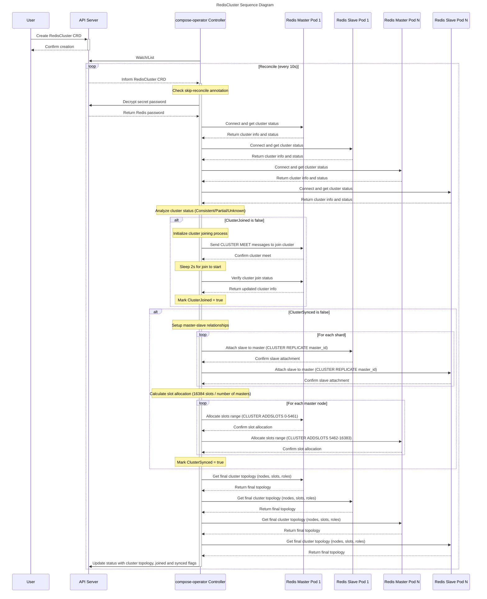

# Compose Operator Architecture

This document provides a detailed architectural overview of the Compose Operator, explaining its design principles, components, and how they work together to manage database replication topologies.

## Table of Contents

- [Design Principles](#design-principles)
- [System Overview](#system-overview)
- [Core Components](#core-components)
- [Feature Overview](#feature-overview)
- [Data Flow](#data-flow)
- [Controller Sequence Diagrams](#controller-sequence-diagrams)
- [Security Model](#security-model)
- [Extensibility](#extensibility)
- [Performance Considerations](#performance-considerations)

## Design Principles

### 1. Kubernetes Native
The operator follows Kubernetes patterns and extends the API using Custom Resource Definitions (CRDs), making it feel like a native Kubernetes resource.

### 2. Database Agnostic
The architecture supports multiple database types (MySQL, Redis, PostgreSQL, ProxySQL) through a pluggable design with database-specific utilities.

### 3. Non-Invasive Management
Unlike other operators, Compose Operator only manages replication relationships without creating the underlying database pods, allowing integration with existing database pod deployments within the Kubernetes cluster.

### 4. Declarative Configuration
Users declare the desired replication state, and the operator continuously reconciles the actual state to match.

### 5. High Availability
The operator is designed to be stateless and can run in multiple replicas for high availability.

## System Overview

```
┌─────────────────────────────────────────────────────────────────────────────────┐
│                                User Layer                                       │
├─────────────────────────────────────────────────────────────────────────────────┤
│  kubectl  │  GitOps  │  Helm Charts  │  Custom Applications  │  Web UI          │
└─────────────────────┬───────────────────────────────────────────────────────────┘
                      │
                      ▼
┌─────────────────────────────────────────────────────────────────────────────────┐
│                            Kubernetes API Server                               │
├─────────────────────────────────────────────────────────────────────────────────┤
│                              Custom Resources                                   │
│  MysqlReplication │ RedisReplication │ PostgresReplication │ ProxysqlSync     │
└─────────────────────┬───────────────────────────────────────────────────────────┘
                      │
                      ▼
┌─────────────────────────────────────────────────────────────────────────────────┐
│                           Compose Operator                                     │
├─────────────────────────────────────────────────────────────────────────────────┤
│                               Controllers                                       │
│     MySQL Controller    │    Redis Controller    │    PostgreSQL Controller   │
├─────────────────────────────────────────────────────────────────────────────────┤
│                              Database Utils                                     │
│    mysqlutil    │    redisutil    │    postgresutil    │    proxysqlutil       │
└─────────────────────┬───────────────────────────────────────────────────────────┘
                      │
                      ▼
┌─────────────────────────────────────────────────────────────────────────────────┐
│                         Database Pods (Kubernetes)                          │
├─────────────────────────────────────────────────────────────────────────────────┤
│  MySQL Pods       │  Redis Pods       │  PostgreSQL Pods       │  ProxySQL    │
│  (Source/Replica) │  (Source/Replica) │  (Primary/Standby)     │  Pods        │
└─────────────────────────────────────────────────────────────────────────────────┘
```

## Core Components

### 1. Custom Resource Definitions (CRDs)

#### MysqlReplication
Manages MySQL replication topologies including:
- **Asynchronous replication** (`rpl_async`)
- **Semi-synchronous replication** (`rpl_semi_sync`)

```go
type MysqlReplicationSpec struct {
    Mode     MysqlReplicationMode     `json:"mode"`
    Secret   MysqlReplicationSecret   `json:"secret"`
    Source   *CommonNode              `json:"source"`
    Replica  ReplicaNodes             `json:"replica,omitempty"`
    Service  *Service                 `json:"service"`
}
```

#### MysqlGroupReplication
Manages MySQL Group Replication for multi-source setups:

```go
type MysqlGroupReplicationSpec struct {
    Secret   MysqlGroupReplicationSecret `json:"secret"`
    Member   CommonNodes                 `json:"member"`
}

type MysqlGroupReplicationNode struct {
    Host          string                      `json:"host"`
    Port          int                         `json:"port"`
    Role          MysqlGroupReplicationRole   `json:"role"`
    Status        NodeStatus                  `json:"status"`
    GtidExecuted  string                      `json:"gtidExecuted"`
    MemberState   string                      `json:"memberState"`
    ReadOnly      bool                        `json:"readonly"`
    SuperReadOnly bool                        `json:"superReadonly"`
}
```

#### RedisReplication
Manages Redis source-replica replication:

```go
type RedisReplicationSpec struct {
    Secret  RedisReplicationSecret `json:"secret"`
    Source  *CommonNode            `json:"source"`
    Replica CommonNodes            `json:"replica,omitempty"`
    Service *Service               `json:"service"`
}
```

#### RedisCluster
Manages Redis cluster topology with multiple members:

```go
type RedisClusterSpec struct {
    Secret  RedisClusterSecret    `json:"secret"`
    Members map[string]CommonNodes `json:"members"`
}
```

#### PostgresReplication
Manages PostgreSQL primary-standby streaming replication:
> **Note**: Currently only compatible with PostgreSQL instances created using Unit CRDs from [github.com/upmio/unit-operator](https://github.com/upmio/unit-operator).

```go
type PostgresReplicationSpec struct {
    Secret  PostgresReplicationSecret `json:"secret"`
    Primary *CommonNode               `json:"primary"`
    Standby CommonNodes               `json:"standby,omitempty"`
    Service *Service                  `json:"service"`
}
```

#### ProxysqlSync
Synchronizes ProxySQL configuration with MySQL topology:

```go
type ProxysqlSyncSpec struct {
    Proxysql         CommonNodes         `json:"proxysql"`
    Secret           ProxysqlSyncSecret  `json:"secret"`
    MysqlReplication string              `json:"mysqlReplication"`
    Rule             *Rule               `json:"rule"`
}
```

### 2. Controllers

Each CRD has a dedicated controller that implements the reconciliation loop:

#### Controller Structure
```go
type MysqlReplicationReconciler struct {
    client.Client
    Scheme *runtime.Scheme
    Log    logr.Logger
}

func (r *MysqlReplicationReconciler) Reconcile(ctx context.Context, req ctrl.Request) (ctrl.Result, error) {
    // 1. Fetch the custom resource
    // 2. Validate the configuration
    // 3. Connect to database instances
    // 4. Configure replication
    // 5. Create/update services
    // 6. Update status
    // 7. Schedule next reconciliation
}
```

#### Reconciliation Logic
1. **Fetch Resource**: Get the current state of the custom resource
2. **Validate**: Ensure the configuration is valid and complete
3. **Connect**: Establish connections to all database pods within the cluster
4. **Configure**: Set up replication relationships based on spec
5. **Services**: Label database pods and create/update Kubernetes services with proper selectors
6. **Status Update**: Report current topology status and replication health
7. **Monitoring**: Continuously monitor replication status for admin observation
8. **Error Handling**: Handle failures and retry with backoff

### 3. Database Utilities

#### mysqlutil Package
- **client.go**: MySQL connection management
- **replication.go**: Replication setup and management
- **group.go**: MySQL Group Replication
- **user.go**: User and privilege management
- **sql.go**: SQL query execution

#### redisutil Package
- **client.go**: Redis connection management
- **replication.go**: Master-slave replication
- **cluster.go**: Redis cluster operations
- **clusteradmin.go**: Cluster management commands

#### postgresutil Package
- **client.go**: PostgreSQL connection management
- **replication.go**: Streaming replication setup
- **admin.go**: Administrative operations

#### proxysqlutil Package
- **admin.go**: ProxySQL administration
- **server.go**: Backend server management

## Feature Overview

### MysqlReplication

Manages MySQL replication topologies with the following capabilities:

1. **Master-Slave Replication Management**: Automatically builds master-slave replication relationships by defining master and slave nodes in the spec. Supports switching functionality by replacing master and slave nodes.

2. **Status Monitoring**: Periodically retrieves node roles, delay times, and other relevant data from MySQL instances and updates these status roles into the CRD Status.

3. **Service Exposure**: Creates read and write services for MySQL master and slave nodes respectively by updating MySQL Pod labels and creating Services, enabling applications to implement read-write separation.

**Supported Replication Modes:**
- **Asynchronous replication** (`rpl_async`)
- **Semi-synchronous replication** (`rpl_semi_sync`)

### MysqlGroupReplication

Manages MySQL Group Replication for multi-source setups with the following capabilities:

1. **Group Replication Management**: Automatically sets up and manages MySQL Group Replication clusters with multiple nodes. Ensures consistent group configuration across all members.

2. **Automatic Node Join/Leave**: Detects offline or missing nodes and automatically attempts to rejoin them to the group. Handles group status transitions and member state changes.

3. **Primary Election**: Supports automatic primary election within the group. When the group is unset, elects a primary node to bootstrap the group.

4. **Configuration Management**: Ensures proper group_replication_group_seeds and group_replication_ip_allowlist configuration across all nodes.

5. **Status Monitoring**: Continuously monitors group status, member states, GTID execution, and node health.

### RedisReplication

Manages Redis master-slave replication with the following features:

1. **Master-Slave Replication**: Automatically builds master-slave replication relationships by defining master and slave nodes in the spec. Supports switching functionality by replacing master and slave nodes.

2. **Status Monitoring**: Periodically obtains roles and other relevant data from Redis instances and updates these status roles into the CRD Status.

3. **Service Management**: Creates read and write services for Redis master and slave nodes respectively by updating Redis Pod labels and creating Services, enabling applications to implement read-write separation.

4. **Sentinel Compatibility**: Compatible with Redis Sentinel Architecture by adding `skip-reconcile=true` key-value pairs in Annotation, avoiding operation of Redis master-slave clusters and delivering master-slave role settings to the Sentinel Manager.
   - When `spec.sentinel` is provided, the controller writes the label `compose-operator.redisreplication.source=<current-source-pod>` to each listed Sentinel pod (or `unknown` if the source cannot be determined). Sentinel containers can read this label at startup to inject the active master into their configuration after restarts.

### RedisCluster

Manages Redis cluster topology with the following capabilities:

1. **Cluster Management**: Manages clustering relationships between Redis instances and automatically builds Redis clusters by defining slices in the spec and master/slave nodes in each slice.

2. **Slot Allocation**: Automatically allocates 16384 slot slots equally to each slice based on the number of slices.

3. **Status Monitoring**: Periodically fetches relevant data such as node roles from Redis instances and updates these status roles into the CRD Status.

### ProxysqlSync

Synchronizes ProxySQL configuration with MySQL topology:

1. **Topology Synchronization**: Gets the topology status from the specified MysqlReplication and updates the mysql_server table in real time to enable proxy access for MySQL master-slave architecture.

2. **User Synchronization**: Gets user information from MySQL according to user filtering rules and synchronizes it to the mysql_user table in ProxySQL.

### PostgresReplication

**Note**: Currently only compatible with PostgreSQL instances created using Unit CRDs from [github.com/upmio/unit-operator](https://github.com/upmio/unit-operator).

Manages PostgreSQL primary-standby replication:

1. **Primary-Standby Replication**: Manages primary/standby replication relationships between PostgreSQL instances. The primary/standby replication relationship can be built automatically by defining primary and standby nodes in the spec, and switching functionality can be realized by replacing primary and standby nodes.

2. **Status Monitoring**: Periodically gets node roles, delay times, and other relevant data from PostgreSQL instances and updates these status roles into the CRD Status.

3. **Service Management**: Creates read and write services for PostgreSQL primary and standby nodes respectively by updating PostgreSQL Pod labels and creating Services, enabling applications to implement read-write separation.

### 4. Supporting Components

#### k8sutil Package
Kubernetes-specific utilities:
- **pod.go**: Pod operations and discovery
- **exec.go**: Command execution in pods

#### utils Package
Common utilities:
- **aes.go**: Password encryption/decryption
- **string.go**: String manipulation helpers
- **compare.go**: Configuration comparison

## Data Flow

### 1. Resource Creation Flow

```
User creates CRD ──► Kubernetes API ──► Controller watches ──► Reconcile triggered
                                                                      │
                                                                      ▼
Update status ◄── Create services ◄── Configure replication ◄── Validate config
      │                                        │
      ▼                                        ▼
 Next reconcile                        Connect to databases
```

## Controller Sequence Diagrams

### MysqlReplication Sequence Diagram


### RedisReplication Sequence Diagram


### MysqlGroupReplication Sequence Diagram


### RedisCluster Sequence Diagram



### ProxysqlSync Sequence Diagram


### PostgresReplication Sequence Diagram


### 2. Replication Setup Flow

```
Controller ──► Connect to source ──► Verify privileges ──► Create replication user
    │                                                              │
    ▼                                                              ▼
Get source position ◄── Backup/restore (if needed) ◄── Connect to replica
    │
    ▼
Configure replica ──► Start replication ──► Verify sync ──► Update status
```

### 3. Service Creation Flow

```
Analyze topology ──► Determine roles ──► Label pods ──► Create write service ──► Create read service
      │                    │              │                   │                      │
      ▼                    ▼              ▼                   ▼                      ▼
Pod discovery      Source/Primary     Add labels      Service selectors      Service selectors
                   Replica/Standby    to pods         for source pods        for replica pods
```

### 4. Pod Labeling and Service Management

The operator manages Kubernetes services by:
1. **Pod Discovery**: Identifies database pods by hostname/name matching
2. **Label Management**: Applies labels to pods based on their replication role:
   - `compose-operator.io/role: source` (for source/primary pods)
   - `compose-operator.io/role: replica` (for replica/standby pods)
   - `compose-operator.io/resource: <resource-name>`
3. **Service Creation**: Creates services with selectors matching the labels:
   - Write service: Selects pods with `role: source`
   - Read service: Selects pods with `role: replica`

### 5. Manual Failover/Switchover Flow

```
Admin observes ──► Check resource ──► Identify issues ──► Update spec configuration
   status           status.topology     (node failure)         (change source)
      │                    │                   │                      │
      ▼                    ▼                   ▼                      ▼
Monitor metrics     Replication lag     Connection errors     Modify source field
      │                    │                   │                      │
      ▼                    ▼                   ▼                      ▼
   Dashboard         kubectl describe    kubectl logs        kubectl apply
      │                    │                   │                      │
      └────────────────────┼───────────────────┼──────────────────────┘
                           ▼
              Controller reconciles ──► Reconfigure replication ──► Update services
```

## Security Model

### 1. Authentication
- Database passwords are AES-256-CTR encrypted
- Passwords stored in Kubernetes Secrets
- Operator decrypts passwords at runtime

### 2. Authorization
- RBAC controls operator permissions
- Database users require specific privileges
- Principle of least privilege

### 3. Network Security
- TLS support for database connections
- Network policies for traffic isolation
- No plaintext password transmission

### 4. Secret Management
```go
type SecretRef struct {
    Name        string `json:"name"`
    MySQL       string `json:"mysql,omitempty"`
    Replication string `json:"replication,omitempty"`
    Redis       string `json:"redis,omitempty"`
    Proxysql    string `json:"proxysql,omitempty"`
}
```

## Extensibility

### 1. Adding New Database Types

To add support for a new database type:

1. **Create CRD**: Define the custom resource structure
2. **Implement Controller**: Create the reconciliation logic
3. **Database Utilities**: Implement database-specific operations
4. **Register**: Add to the controller manager

Example structure for a new database:
```
api/v1alpha1/
├── newdb_types.go          # CRD definition
controller/newdb/
├── newdb_controller.go     # Controller logic
├── helper.go              # Helper functions
└── status.go               # Status management
pkg/newdbutil/
├── client.go               # Database client
├── replication.go          # Replication logic
└── admin.go                # Administrative functions
```

### 2. Plugin Architecture

The operator supports pluggable components:

```go
type DatabaseManager interface {
    Connect(host string, port int, credentials Credentials) error
    SetupReplication(source, replica DatabaseInstance) error
    GetTopology() (Topology, error)
    Disconnect() error
}
```

## Performance Considerations

### 1. Reconciliation Frequency
- Default reconciliation interval: 30 seconds
- Configurable via controller flags
- Event-driven reconciliation for immediate response

### 2. Connection Pooling
- Reuse database connections where possible
- Connection timeout and retry logic
- Pool size based on replica count

### 3. Parallel Processing
- Multiple controllers can run concurrently
- Separate goroutines for different database types
- Work queues for handling multiple resources

### 4. Resource Limits
```yaml
resources:
  limits:
    cpu: 200m
    memory: 256Mi
  requests:
    cpu: 100m
    memory: 128Mi
```

### 5. Monitoring and Metrics
- Prometheus metrics for performance monitoring
- Health checks for operator availability
- Database connection status monitoring

## Error Handling and Recovery

### 1. Retry Logic
- Exponential backoff for failed operations
- Maximum retry attempts
- Circuit breaker pattern for persistent failures

### 2. Graceful Degradation
- Continue operating with partial functionality
- Mark unhealthy instances in status
- Provide detailed status information for manual intervention
- Recovery requires administrator action to update spec configuration

### 3. Status Reporting
```go
type MysqlReplicationStatus struct {
    Phase       string                 `json:"phase,omitempty"`
    Conditions  []metav1.Condition     `json:"conditions,omitempty"`
    Topology    ReplicationTopology    `json:"topology,omitempty"`
    Services    ServiceStatus          `json:"services,omitempty"`
}
```

## Future Architecture Considerations

### 1. Cross-Cluster Support
- Manage databases across different Kubernetes clusters
- Federated control plane architecture
- Cross-cluster replication topology
- Global service discovery and load balancing

### 2. External Database Support
- Support for databases running outside Kubernetes clusters
- Custom endpoint and service discovery mechanisms
- Extended networking and connectivity options

### 3. Advanced Scheduling
- Resource-aware placement
- Affinity/anti-affinity rules
- Disaster recovery planning

### 4. Backup Integration
- Automated backup scheduling
- Point-in-time recovery
- Backup verification

This architecture provides a solid foundation for managing database replication at scale while maintaining flexibility and extensibility for future enhancements.